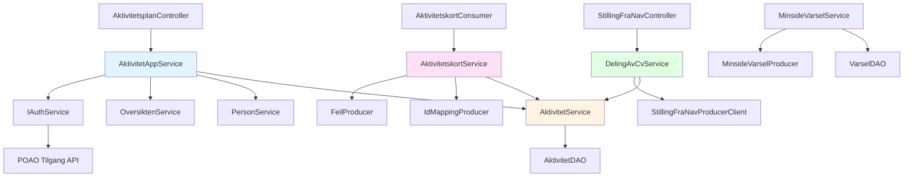
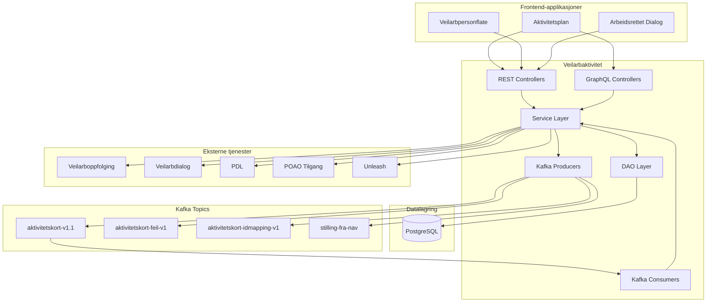
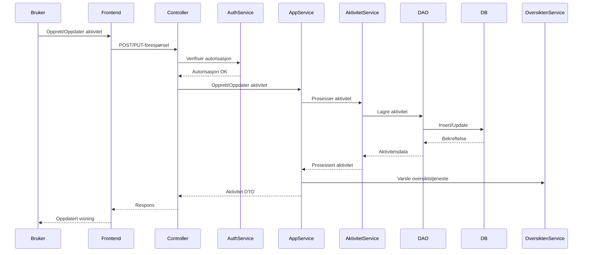
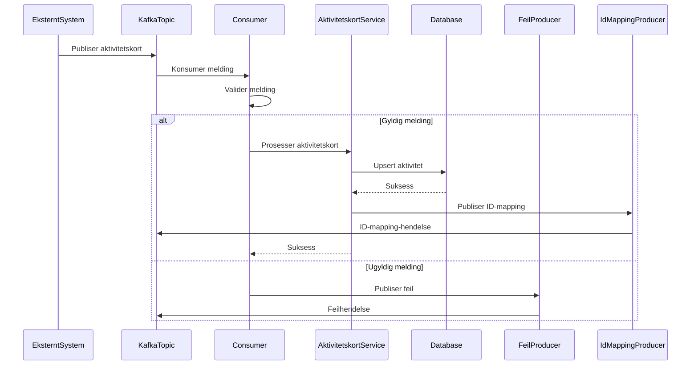
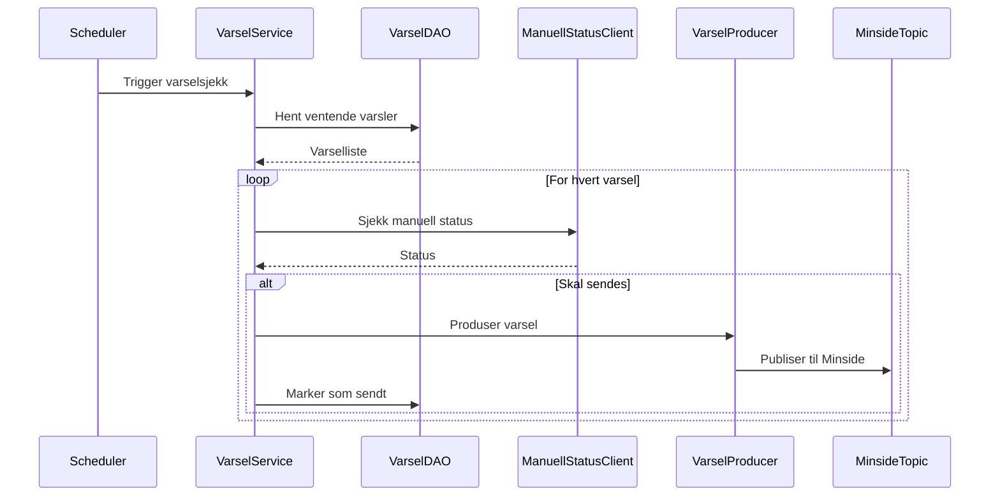

# Veilarbaktivitet
[](https://github.com/navikt/veilarbaktivitet/actions)
[](https://sonarcloud.io/dashboard?id=navikt_veilarbaktivitet)
Backend-applikasjon for aktivitetsplanen. Tilbyr REST og GraphQL-tjenester for å administrere aktiviteter i forbindelse med arbeidsoppfølging.
## Innholdsfortegnelse
- [Oversikt](#oversikt)
- [Moduler og avhengigheter](#moduler-og-avhengigheter)
- [Arkitektur](#arkitektur)
- [Teknologier](#teknologier)
- [Kom i gang](#kom-i-gang)
  - [Forutsetninger](#forutsetninger)
  - [Installasjon](#installasjon)
  - [Lokal utvikling](#lokal-utvikling)
  - [Kjøre tester](#kjøre-tester)
- [API-dokumentasjon](#api-dokumentasjon)
  - [REST API](#rest-api)
  - [GraphQL API](#graphql-api)
  - [Internt API](#internt-api)
- [Viktige arbeidsflyter](#viktige-arbeidsflyter)
  - [Aktivitetshåndtering](#aktivitetshåndtering)
  - [Kafka-meldingsprosessering](#kafka-meldingsprosessering)
  - [Varslingsflyt](#varslingsflyt)
- [Database](#database)
- [Kafka-integrasjon](#kafka-integrasjon)
- [Konfigurasjon](#konfigurasjon)
- [Overvåking og observerbarhet](#overvåking-og-observerbarhet)
- [Bidra](#bidra)
- [Lisens](#lisens)
- [Kontakt](#kontakt)
## Oversikt
Veilarbaktivitet er en Spring Boot-applikasjon som fungerer som backend for NAVs aktivitetsplan-system. Den håndterer ulike typer aktiviteter som brukere deltar i som del av deres arbeidsoppfølging, inkludert:
- Jobbsøknader
- Jobbsøkingsavtaler
- Treningsaktiviteter
- Behandlingsaktiviteter
- Møter med NAV-veiledere
- Egeninitierte aktiviteter
- Aktiviteter fra eksterne systemer (Arena, eksterne partnere)

Applikasjonen tilbyr et omfattende API for å opprette, oppdatere og spore aktiviteter, samt å håndtere varsler og integrere med ulike NAV-systemer.

## Moduler og avhengigheter

### Hovedmoduler

Applikasjonen er strukturert i flere moduler med klare ansvarsområder:

#### 1. **aktivitet** - Kjernedomene
Hovedmodul for aktivitetshåndtering med:
- `AktivitetService` - Forretningslogikk for aktiviteter
- `AktivitetAppService` - Applikasjonslag med autorisasjon og integrasjoner
- `AktivitetDAO` - Databasetilgang
- `AktivitetsplanController` (REST) og `AktivitetskortController` (GraphQL)

#### 2. **aktivitetskort** - Integrasjon med eksterne systemer
Håndterer aktivitetskort fra Arena og andre eksterne partnere:
- `AktivitetskortConsumer` - Kafka-konsument for aktivitetskort
- `AktivitetskortService` - Prosessering av aktivitetskort
- `AktivitetsKortFeilProducer` - Publisering av feilmeldinger
- `IdMappingProducer` - ID-mapping mellom eksterne og interne systemer

#### 3. **stilling_fra_nav** - Stillingsintegrasjon
Håndterer deling av stillinger fra NAV:
- `DelingAvCvService` - Forretningslogikk for CV-deling
- `StillingFraNavProducerClient` - Kafka-produsent for stillingsoppdateringer
- `OpprettForesporselOmDelingAvCv` - Opprettelse av forespørsler

#### 4. **brukernotifikasjon** - Varslingssystem
Varsling av brukere via Minside:
- `MinsideVarselService` - Håndtering av brukernotifikasjoner
- `VarselDAO` - Lagring av varsler
- `MinsideVarselProducer` - Publisering til Minside

#### 5. **oppfolging** - Oppfølgingsperioder
Håndtering av oppfølgingsperioder:
- `OppfolgingsperiodeService` - Henting og oppdatering av perioder
- `SistePeriodeService` - Identifisering av siste periode

#### 6. **avtalt_med_nav** - Avtaler
Håndtering av aktiviteter avtalt med NAV:
- `AvtaltMedNavController` - REST-endepunkter
- `AvtaltMedNavService` - Forretningslogikk for avtaler
- Forhaandsorientering (FHO) - Håndtering av forhåndsorientering

#### 7. **arena** - Arena-integrasjon
Integrasjon med NAVs Arena-system:
- `ArenaService` - Henting av tiltaksaktiviteter
- `MigreringService` - Migrering fra Arena til nye systemer

### Viktige avhengigheter

#### NAV-biblioteker
- **no.nav.common** (v3.2025.10.10) - Felles bibliotek for:
  - `kafka` - Kafka-integrasjon
  - `auth` - Autentisering og autorisasjon
  - `token-client` - Token-håndtering (Azure AD, TokenX)
  - `metrics` - Metrikker og logging
  - `client` - HTTP-klienter
  
- **no.nav.poao.dab:spring-auth** (v2025.12.15) - DAB-spesifikk autentisering
- **no.nav.tms.varsel:kotlin-builder** (v2.1.1) - Bygging av brukernotifikasjoner

#### Eksterne biblioteker
- **Apache Kafka** - Meldingskø
  - `kafka-avro-serializer` (v8.1.0) - Avro-serialisering
  - `spring-kafka` - Spring-integrasjon
  
- **Unleash** (v11.1.1) - Feature toggles for gradvis utrulling
- **ShedLock** (v6.10.0) - Distribuert låsing for planlagte jobber
- **Google Cloud BigQuery** - Analyse og logging
- **Flyway** - Databasemigreringer
- **WireMock** - Mocking av eksterne tjenester i tester

#### Spring Boot Starters
- `spring-boot-starter-web` - REST API
- `spring-boot-starter-graphql` - GraphQL API
- `spring-boot-starter-data-jdbc` - Database-tilgang
- `spring-boot-starter-actuator` - Helsesjekker og metrikker
- `spring-boot-starter-quartz` - Planlagte jobber

### Modulavhengigheter



## Arkitektur

## Teknologier
- **Språk**: Java 21, Kotlin
- **Rammeverk**: Spring Boot 3.5.5
- **Database**: PostgreSQL 14
- **Meldingskø**: Apache Kafka
- **API**: REST, GraphQL
- **Byggverktøy**: Gradle (Kotlin DSL)
- **Containerisering**: Docker
- **Skyplattform**: NAIS (GCP)
- **Observerbarhet**: Prometheus, Grafana, Elastic
- **Feature Toggles**: Unleash
- **Testing**: JUnit 5, Mockito, Rest Assured, WireMock
## Kom i gang

### Forutsetninger

- JDK 21
- Gradle (inkludert via wrapper)

### Installasjon

Klon repositoriet:

```bash
git clone https://github.com/navikt/veilarbaktivitet.git
cd veilarbaktivitet
```

### Lokal utvikling

Applikasjonen er **ikke lagt opp for lokal kjøring** med eksterne tjenester. I stedet bruker utviklere et testoppsett som inkluderer alle nødvendige avhengigheter.

#### Testkjøring med embedded tjenester

Applikasjonen har et komplett testoppsett (`SpringBootTestBase`) som automatisk starter:

- **Embedded PostgreSQL** - via `@AutoConfigureEmbeddedDatabase`
- **Embedded Kafka** - via `EmbeddedKafkaBroker`  
- **WireMock** - for mocking av eksterne tjenester (PDL, Veilarbdialog, POAO Tilgang, osv.)

**Kjør applikasjonen i testmodus:**

Du kan kjøre `VeilarbAktivitetTestApp.main()` direkte fra IDE for lokal utvikling/testing. Dette starter applikasjonen med:
- Embedded PostgreSQL med Flyway-migreringer
- Embedded Kafka med alle nødvendige topics
- WireMock-servere for eksterne API-er
- Test-autentisering via `TestAuthContextFilter`

**Testkonfigurasjon:**

`SpringBootTestBase` er baseklassen for alle integrasjonstester og konfigurerer automatisk:
```java
@SpringBootTest(webEnvironment = SpringBootTest.WebEnvironment.RANDOM_PORT)
@WireMockTest
@SharedSpies
public abstract class SpringBootTestBase {
    // Embedded PostgreSQL
    // Embedded Kafka  
    // WireMock for eksterne tjenester
    // Test-brukere og veiledere via NavMockService
}
```

### Kjøre tester

Kjør alle tester:

```bash
./gradlew test
```

Kjør med dekningsrapport:

```bash
./gradlew test jacocoTestReport
```

Testene arver fra `SpringBootTestBase` og får automatisk tilgang til fullt konfigurert Spring-kontekst med alle nødvendige mocks og embedded tjenester.
## API-dokumentasjon
### REST API
REST API-et er definert ved hjelp av OpenAPI-spesifikasjon og tilbyr endepunkter for aktivitetshåndtering.
#### Hovedendepunkter
**Aktivitetshåndtering** (`/api/aktivitet`)
- `GET /api/aktivitet` - Hent alle aktiviteter for en bruker
- `GET /api/aktivitet/{id}` - Hent en spesifikk aktivitet
- `POST /api/aktivitet/ny` - Opprett en ny aktivitet
- `PUT /api/aktivitet/{id}` - Oppdater en eksisterende aktivitet
- `PUT /api/aktivitet/{id}/status` - Oppdater aktivitetsstatus
- `PUT /api/aktivitet/{id}/etikett` - Oppdater aktivitetsetikett
**Eksempel: Opprett en ny aktivitet**
```bash
curl -X POST http://localhost:8080/veilarbaktivitet/api/aktivitet/ny \
  -H "Content-Type: application/json" \
  -H "Authorization: Bearer ${TOKEN}" \
  -d '{
    "tittel": "Jobbsøknad hos Bedrift X",
    "beskrivelse": "Søkt på stilling som programvareutvikler",
    "type": "STILLING",
    "status": "GJENNOMFORES",
    "fraDato": "2026-01-27T10:00:00Z",
    "tilDato": "2026-02-27T10:00:00Z"
  }'
```
**Avtale med NAV** (`/api/avtaltMedNav`)
- `PUT /api/avtaltMedNav/{aktivitetId}/sett` - Marker aktivitet som avtalt med NAV
- `PUT /api/avtaltMedNav/{aktivitetId}/fjern` - Fjern avtalt-status
**Administrasjon** (`/api/kassering`)
- `PUT /api/kassering/{aktivitetId}` - Arkiver/slett aktivitet (kun admin)
### GraphQL API
GraphQL-endepunktet er tilgjengelig på `/veilarbaktivitet/graphql`.
**Schemaoversikt**
Hovedspørringstyper:
- `perioder(fnr: String!)` - Hent alle oppfølgingsperioder med aktiviteter
- `aktivitet(aktivitetId: String)` - Hent spesifikk aktivitet
- `eier(aktivitetId: String)` - Få eier av en aktivitet
- `tiltaksaktiviteter(fnr: String!)` - Hent tiltaksaktiviteter fra Arena
**Eksempel: Hent alle aktiviteter for en bruker**
```graphql
query HentAktiviteter($fnr: String!) {
  perioder(fnr: $fnr) {
    id
    start
    slutt
    aktiviteter {
      id
      tittel
      beskrivelse
      type
      status
      fraDato
      tilDato
      avtalt
      historikk {
        endringer {
          endretAv
          tidspunkt
          beskrivelseForBruker
        }
      }
    }
  }
}
```
**Eksempel: Hent aktivitetshistorikk**
```graphql
query HentAktivitetshistorikk($aktivitetId: String) {
  aktivitet(aktivitetId: $aktivitetId) {
    id
    tittel
    historikk {
      endringer {
        endretAvType
        endretAv
        tidspunkt
        beskrivelseForVeileder
        beskrivelseForBruker
        beskrivelseForArkiv
      }
    }
  }
}
```
### Internt API
Internt API for tjeneste-til-tjeneste-kommunikasjon (`/internal/api/v1`)
- `GET /internal/api/v1/aktivitet?aktorId={aktorId}` - Hent aktiviteter etter aktør-ID
## Viktige arbeidsflyter
### Aktivitetshåndtering

### Kafka-meldingsprosessering
Applikasjonen konsumerer og produserer meldinger fra/til ulike Kafka-topics.

**Viktige Kafka-topics:**
- **Konsumerte:**
  - `dab.aktivitetskort-v1.1` - Aktivitetskort fra eksterne systemer
  - `pto.deling-av-stilling-fra-nav-forespurt-v2` - Forespørsler om deling av stillinger
  - `pto.rekrutteringsbistand-statusoppdatering-v1` - Statusoppdateringer fra rekrutteringsbistand
- **Produserte:**
  - `dab.aktivitetskort-feil-v1` - Feilmeldinger for mislykket prosessering
  - `dab.aktivitetskort-idmapping-v1` - ID-mapping mellom eksterne og interne ID-er
  - `pto.aktivitet-portefolje-v1` - Porteføljeoppdateringer
  - `pto.stilling-fra-nav-oppdatert-v2` - Oppdateringer om stillinger fra NAV
### Varslingsflyt

## Database
Applikasjonen bruker PostgreSQL med Flyway for databasemigreringer.
**Viktige tabeller:**
- `AKTIVITET` - Hovedtabell for aktiviteter
- `AKTIVITETSKORT_MSG_ID` - Sporing av aktivitetskortmeldinger
- `BRUKERNOTIFIKASJON` - Brukervarsler
- `OPPFOLGING_PERIODE` - Oppfølgingsperioder
- `BATCH_TRACKING` - Sporing av batch-jobber
- `SHEDLOCK` - Distribuert lås for planlagte oppgaver
**Migreringsplassering:** `src/main/resources/db/migration/`
**Kjøring av migreringer:**
Migreringer kjøres automatisk ved oppstart av applikasjonen. Skjemaet administreres under `veilarbaktivitet`-skjemaet.
## Kafka-integrasjon
### Consumer-konfigurasjon
```kotlin
// Consumer group
spring.kafka.consumer.group-id=veilarbaktivitet-consumer
// Konsumeringsinnstillinger
spring.kafka.consumer.max-poll-records=1
spring.kafka.consumer.auto-offset-reset=earliest
```
### Producer-konfigurasjon
```kotlin
// Producer-innstillinger
spring.kafka.producer.acks=all
spring.kafka.producer.retries=10000
```
### Meldingsprosessering
Meldinger prosesseres med idempotensgarantier ved å bruke meldings-ID-er lagret i databasen for å forhindre duplikatprosessering.
## Konfigurasjon
### Miljøvariabler
Viktige miljøvariabler som kreves:
```bash
# Database
DB_JDBC_URL=jdbc:postgresql://localhost:5432/veilarbaktivitet
DB_USERNAME=veilarbaktivitet
DB_PASSWORD=<passord>
# Kafka
KAFKA_BROKERS=<kafka-brokers>
KAFKA_SCHEMA_REGISTRY=<schema-registry-url>
# Eksterne tjenester
PDL_URL=<pdl-api-url>
PDL_SCOPE=<pdl-scope>
VEILARBDIALOG_URL=<veilarbdialog-url>
NORG2_URL=<norg2-url>
# Unleash
UNLEASH_SERVER_API_URL=<unleash-url>
UNLEASH_SERVER_API_TOKEN=<token>
# GCP
GCP_TEAM_PROJECT_ID=<project-id>
```
### Profiler
- `local` - Lokal utviklingskonfigurasjon
- `test` - Testkonfigurasjon med embedded database
- Standard - Produksjonslignende konfigurasjon
## Overvåking og observerbarhet
### Helsesjekker
- **Liveness**: `/veilarbaktivitet/internal/isAlive`
- **Readiness**: `/veilarbaktivitet/internal/isReady`
### Metrikker
Prometheus-metrikker tilgjengelig på:
- `/veilarbaktivitet/internal/prometheus`
### Logging
- **Applikasjonslogger**: Strukturert JSON-logging til Elastic og Loki
- **Sikre logger**: Sensitiv data logges til sikker loggdestinasjon
- **Audit-logging**: Autorisasjonsbeslutninger og datatilgang
### Varsler
SLO-basert varsling konfigurert for:
- HTTP-responstider (p95, p99)
- Feilrater
- Kafka consumer lag
- Database connection pool
## Bidra
### Retningslinjer for utvikling
1. **Kodestil**: Følg eksisterende kodekonvensjoner. Prosjektet bruker Kotlin og Java.
2. **Testing**: Skriv tester for nye funksjoner. Sikt mot høy testdekning.
3. **Commit-meldinger**: Bruk klare, beskrivende commit-meldinger.
4. **Pull Requests**: Opprett PR-er med en klar beskrivelse av endringer.
### Kjøring av kvalitetssjekker
```bash
# Kjør tester med dekning
./gradlew test jacocoTestReport
# Kjør SonarQube-analyse (krever konfigurasjon)
./gradlew sonar
```
### Pull Request-prosess
1. Opprett en feature branch fra `main`
2. Gjør endringene dine med passende tester
3. Sørg for at alle tester kjører lokalt
4. Opprett en pull request med en klar beskrivelse
5. Vent på at CI/CD-pipeline kjører
6. Be om review fra teammedlemmer
7. Adresser review-tilbakemeldinger
8. Merge etter godkjenning
## Lisens
Dette prosjektet er lisensiert under MIT-lisensen - se [LICENSE.md](LICENSE.md)-filen for detaljer.
Copyright 2018 Nav (Arbeids- og velferdsdirektoratet) - The Norwegian Labour and Welfare Administration
## Kontakt
**Team**: Team DAB (Digital Arbeidsoppfølging og Behandling)
**Slack-kanal**: #team_dab_arbeidsoppfølging
For spørsmål, problemer eller bidrag, vennligst:
- Åpne en issue i GitHub for feilrapporter eller funksjonsforespørsler
- Bli med i vår Slack-kanal for diskusjoner og spørsmål
---
<sub>Denne README-filen ble AI-generert 28. januar 2026. For den mest oppdaterte informasjonen, vennligst se kildekoden og inline-dokumentasjon.</sub>
