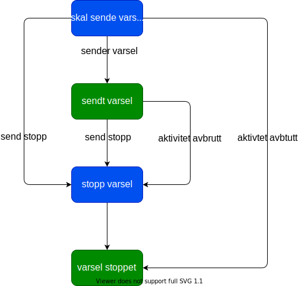
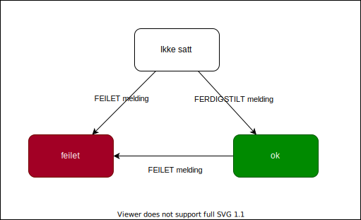

# Bestillling av varsler gjennom brukernotifikasjon

## brukernotifiaksjon docks:

### Brukernotifikasjon

[doks for brukernotifikasjon](https://navikt.github.io/brukernotifikasjon-docs/)   
[slack kanal #brukernotifikasjoner](https://nav-it.slack.com/archives/CR61BPH7G)

### EksternvarselKvitering

[doks for eksternvarsel kvitering](https://confluence.adeo.no/display/BOA/For+Konsumenter)  
[slck kanal #team_dokumentløsninger](https://nav-it.slack.com/archives/C6W9E5GPJ)

## Intern varsel staus:

## Varsel kvitering status:

